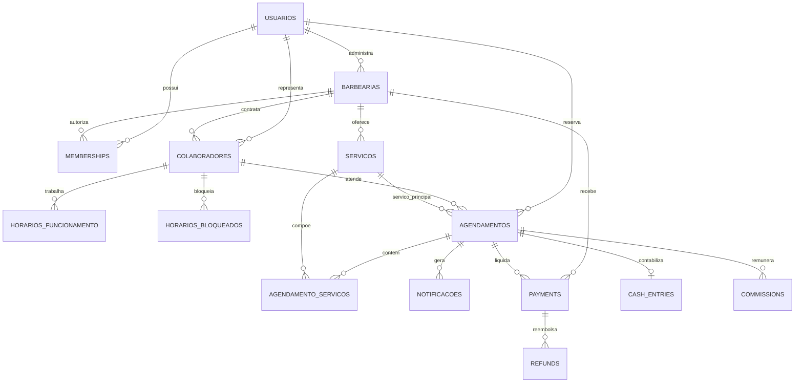

# Modelo do banco de dados

O modelo preserva as tabelas e os contratos SQL consumidos pela API. Para ficar
mais simples de entender, ele esta dividido por dominio.

| Dominio | Tabelas principais | Responsabilidade |
|---|---|---|
| Identidade e tenant | `usuarios`, `barbearias`, `memberships`, `invitations`, `colaboradores` | Pessoas, acesso e equipe por barbearia |
| Agenda | `servicos`, `horarios_funcionamento`, `horarios_bloqueados`, `agendamentos`, `agendamento_servicos` | Catalogo, disponibilidade e reservas |
| Comunicacao | `notificacoes`, `notification_preferences`, `notification_deliveries`, `device_tokens` | Mensagens e canais de entrega |
| Autenticacao | `refresh_tokens`, `otp_challenges` | Sessoes e desafios de acesso |
| Financeiro | `plans`, `subscriptions`, `payment_accounts`, `payments`, `refunds`, `cash_entries`, `commissions` | Assinaturas, cobrancas e caixa |
| Operacao | `webhook_events`, `audit_logs`, `schema_migrations` | Integracoes, auditoria e versao |

## Relacionamentos centrais

## Decisoes de compatibilidade

- `usuarios.role` continua existindo para os fluxos legados; `memberships.papel`
  expressa a permissao dentro de cada barbearia no modelo SaaS.
- `barbearias.admin_id` continua identificando o administrador original;
  `memberships` permite proprietarios e equipe com papeis mais precisos.
- `agendamentos.servico_id` continua sendo o servico principal;
  `agendamento_servicos` registra os itens e seus valores historicos.
- Valores e duracoes cobrados ficam copiados no agendamento para que alteracoes
  futuras no catalogo nao modifiquem o historico.
